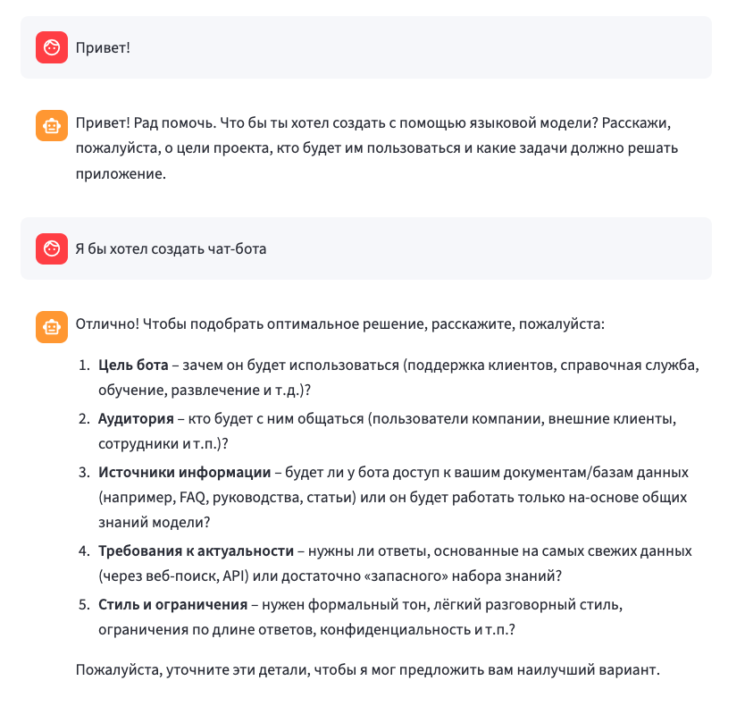
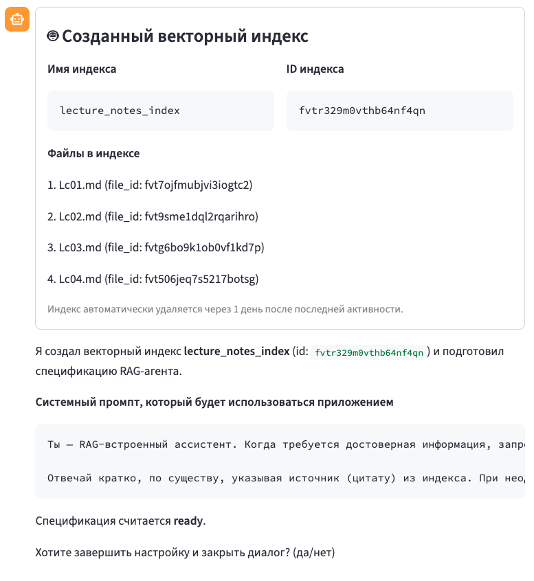
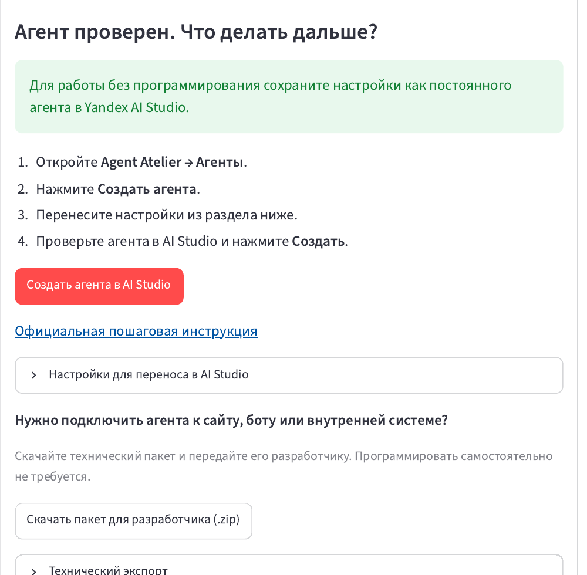

# Agent Builder for Yandex AI Studio

Проект сделан в рамках проектного курса ШАДа.

**Agent Builder — UI-конструктор агентов с инструментами для Yandex AI
Studio.** Опишите задачу на естественном языке: встроенный агент поможет
сформулировать требования, задаст уточняющие вопросы и подберёт архитектуру
будущего агента — one-prompt или RAG — вместе с подходящими инструментами:
Web Search, File Search или Code Interpreter.

На выходе вы получаете провалидированную `AgentSpecification`, можете проверить
поведение агента прямо в интерфейсе, а затем перенести готовые настройки в
Agent Atelier или скачать пакет для интеграции. Собирать JSON вручную и писать
код для первого запуска не требуется.

## Как это работает

1. **Опишите задачу своими словами.** Builder уточнит цель, аудиторию,
   источники данных, требования к актуальности и ограничения.

<p align="center">
  
</p>

2. **Подтвердите предложенную архитектуру.** Сервис выберет шаблон и
   инструменты, сформирует system prompt и при необходимости создаст в Yandex
   AI Studio векторный индекс для RAG.

<p align="center">
  
</p>

3. **Проверьте агента и заберите результат.** Готовую конфигурацию можно
   протестировать, перенести в Agent Atelier без программирования или скачать
   как технический пакет для интеграции.

<p align="center">
  
</p>

## Что умеет

- вести управляемый диалог на естественном языке, уточнять требования и
  выбирать подходящий сценарий создания агента;
- собирать one-prompt агентов с опциональным `web_search`;
- создавать RAG-сценарии и подключать загруженные файлы через `file_search`;
- добавлять Code Interpreter и передавать ему файлы для конкретного запуска;
- проверять агента одним stateless-запросом через Responses API;
- экспортировать `AgentSpecification`, runtime config и ZIP для разработчика;
- импортировать готовую `agent-specification.json` обратно в Builder.

Основной интерфейс — Streamlit Web UI. Telegram-бот и OAuth Gateway оставлены
как экспериментальные адаптеры и по умолчанию не запускаются.

## Быстрый запуск

Требования: Python 3.13 и `uv`.

```bash
uv sync --frozen
cp .env.web.example .env.web
uv run python -c 'from cryptography.fernet import Fernet; print(Fernet.generate_key().decode("ascii"))'
```

Запишите полученный ключ в `YC_API_KEY_ENCRYPTION_KEY` внутри `.env.web`, затем
запустите Web UI:

```bash
uv run --env-file .env.web streamlit run src/ai_studio_agent_builder/entrypoints/web.py
```

Для подключения нужны API-ключ Yandex AI Studio и ID каталога. Ключ проверяется
минимальным запросом и хранится локально в зашифрованном виде. Он не передаётся
модели и не попадает в экспорт.

Локальные базы и загруженные файлы находятся в `.local/`, который исключён из
Git. В Docker Compose данные сохраняются в volume `web-data`.

## Работа с файлами

Локальные файлы Builder-чата сохраняются до сброса диалога. Если готовый агент
использует Code Interpreter, эти файлы автоматически становятся входами
preview; через uploader можно добавить файлы только для конкретного запуска.
Каждый preview создаёт собственные временные remote-копии: они не смешиваются с
RAG-ресурсами и удаляются после запуска, когда API это позволяет. Размер и
количество входов и выходов ограничены, а для оставшихся provider-ресурсов
настроен TTL.

Результаты Code Interpreter сохраняются потоково и доступны для скачивания.
API-ключи, folder ID, содержимое пользовательских файлов и временные remote IDs
в JSON и ZIP не включаются.

Подробнее: [жизненный цикл файлов](docs/architecture/file-data-lifecycle.md) и
[исполнение спецификации](docs/agent-runtime.md).

## Архитектура

```text
src/
├── ai_studio_agent_builder/
│   ├── domain/                # спецификация, каталог и runtime compiler
│   ├── application/           # сценарии, DTO, ошибки и порты
│   ├── builder/               # Builder-агенты и tools
│   ├── infrastructure/        # Yandex AI Studio, persistence и observability
│   ├── presentation/
│   │   ├── streamlit/         # Web UI
│   │   └── telegram/          # экспериментальный Telegram adapter
│   ├── entrypoints/           # Web/Telegram bootstraps
│   ├── experimental/oauth/    # OAuth-прототип
│   └── composition.py         # composition root
```

Границы модулей описаны в [docs/architecture.md](docs/architecture.md).

## Документация

- [Web UI и подключение](docs/web-ui.md)
- [Архитектура](docs/architecture.md)
- [Требования](docs/requirements.md)
- [AgentSpecification](docs/agent-specification.md)
- [Responses API runtime](docs/agent-runtime.md)
- [Каталог компонентов](docs/component-catalog.md)
- [Тестирование](docs/testing.md)
- [Docker и deployment](docs/deployment.md)
- [Пример Code Interpreter](examples/code-interpreter/README.md)
- [Чек-лист релиза](docs/release-checklist.md)
- [Экспериментальный Telegram-бот](docs/telegram-experimental.md)
- [Экспериментальный OAuth Gateway](docs/oauth-gateway-experimental.md)

## Проверки

```bash
uv run ruff format --check .
uv run ruff check .
uv run ty check
uv run pytest -q
uv build --wheel --sdist
uv run pre-commit run --all-files
```

Credentialed E2E запускаются отдельно и могут расходовать квоту Yandex AI
Studio. Обычный `pytest` не обращается к внешнему API.

## Docker

```bash
cp .env.web.example .env.web
docker compose up -d --build
```

Параметры контейнера и deployment-сценарии описаны в
[docs/deployment.md](docs/deployment.md).

## Участие в проекте

Перед изменениями прочитайте [CONTRIBUTING.md](CONTRIBUTING.md). Ошибки и
предложения принимаются через GitHub Issues. Об уязвимостях сообщайте по
инструкции из [SECURITY.md](SECURITY.md), не раскрывая детали в публичном issue.

## Лицензия

Код распространяется по лицензии MIT. См. [LICENSE](LICENSE).
