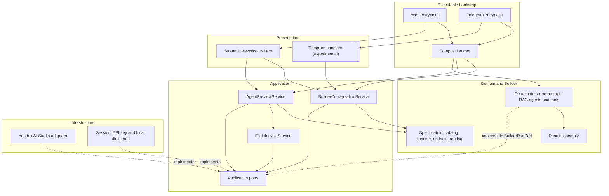

# Container view

## Логические контейнеры



## Направления зависимостей

Разрешённые направления:

```text
presentation ──> application ──> domain
builder ───────> application/domain
infrastructure ─implements─────> application ports
composition ──> presentation/application/infrastructure
entrypoints ──> composition/presentation
```

Запрещены:

- `domain → application|builder|infrastructure|presentation`;
- `application → infrastructure|presentation`;
- `presentation → infrastructure`;
- imports конкретных Responses/Files/Vector Store API types вне infrastructure;
- импорт composition root из любого нижележащего слоя.

Исключение для bootstrap является явным: только thin executable modules из
`entrypoints/` импортируют `composition.py`, получают собранные services и
передают их presentation runner. Модули `presentation/*` composition root не
импортируют.

OpenAI Agents SDK events для Builder разбираются только внутри
`builder/agents/sdk_event_adapter.py` и передаются в result assembly уже как
внутренние события; это не разрешает API clients или raw Responses API objects
в builder/application.

## Ответственности

| Контейнер | Владеет | Не владеет |
| --- | --- | --- |
| Domain | Спецификациями, validation, provider-neutral runtime/artifact DTO | SDK clients, UI state, disk/network I/O |
| Application | Use cases, транзакциями, квотами, orchestration, cleanup policy | Конкретными Builder agents, форматом provider response и рендерингом UI |
| Builder | Реализацией `BuilderRunPort`, LLM instructions, function tools, сборкой typed result parts | Credentials и произвольными provider IDs |
| Infrastructure | API clients, provider requests, persistence, нормализацией ошибок | Бизнес-решениями о маршрутизации и readiness |
| Presentation | Формами, view state, отображением безопасных DTO | Provider clients и authoritative validation |
| Composition | Созданием и связыванием конкретных реализаций | Доменным поведением |

## Composition root

`composition.py` создаёт config, credential/client factories, repositories,
Yandex adapters и application services. Thin Streamlit/Telegram entrypoints
вызывают composition root и передают готовые services presentation modules;
сами views/handlers composition не импортируют. Это оставляет тестам возможность
передавать fake ports без patch глобальных clients.

`BuilderConversationService` вызывает только application-owned
`BuilderRunPort`. Реализация этого port находится в `builder/agents`, внутри
использует Agents SDK и `ResultAssembler` и возвращает нормализованный
`BuilderRunOutcome`. Таким образом application не импортирует builder.
