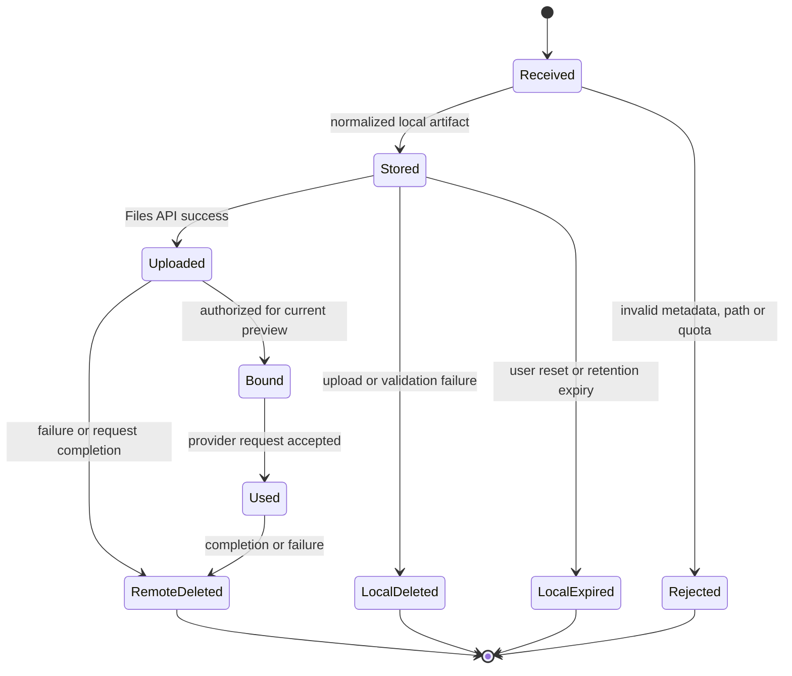
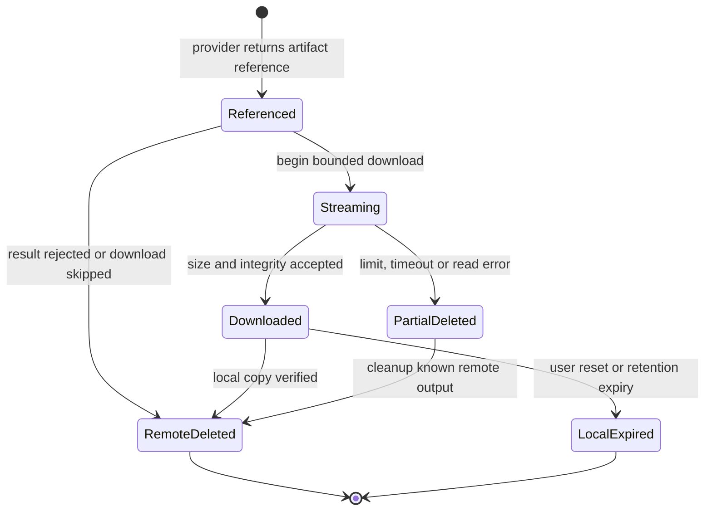

# Жизненный цикл файлов и данных

## Классы данных

| Класс | Примеры | Владелец | Сериализуется в spec |
| --- | --- | --- | --- |
| Domain metadata | purpose, instructions, constraints, tool capability | Domain | Да |
| Local input artifact | user upload в user-scoped directory | Application file lifecycle | Нет |
| Remote input reference | Files API `file_id` для preview | Один preview request | Нет |
| Vector knowledge reference | подтверждённый `index_id` и sources | RAG conversation state | Да, по контракту RAG |
| Container reference | временный `container_id` | Provider adapter/request | Нет |
| Remote output reference | container/file reference из ответа | Один preview request | Нет |
| Local generated artifact | безопасно скачанная копия | Application file lifecycle | Нет |
| Credential | API key, folder authorization | Infrastructure/composition | Никогда |

## Жизненный цикл входного файла

## Жизненный цикл выходного артефакта

## Ownership и cleanup

`PreviewInputFileLifecycle` — application-level владелец реестра входных
remote resources одного preview request. Он предварительно проверяет все local
handles и квоты, регистрирует remote reference сразу после успешного создания,
создаёт request-scoped копию runtime config и выполняет cleanup в `finally`
независимо от того, дошёл ли flow до Responses request.

`ConversationFileService` отдельно владеет сохранением и retention локальных
conversation files. Output artifacts добавляются в CI-4 как отдельная
application responsibility под общей политикой ADR-0003; они не расширяют
runner файловым I/O.

Provider gateway отвечает только за отдельные create/read/delete операции и
нормализацию ошибок. UI не удаляет remote resources, а runner не пишет bytes на
диск.

| Ветка | Local input | Remote input | Partial output | Remote output |
| --- | --- | --- | --- | --- |
| Validation rejected | Не сохранять/удалить | Не создаётся | Не создаётся | Не создаётся |
| Второй upload упал | По retention policy | Удалить уже созданные | Не создаётся | Не создаётся |
| Binding/compiler упал | По retention policy | Удалить все | Не создаётся | Не создаётся |
| Provider timeout/error | По retention policy | Удалить все | Удалить | Удалить известные |
| Output превысил cap | По retention policy | Удалить все | Удалить | Удалить/TTL warning |
| Success | По retention policy | Удалить все | Отсутствует | Удалить после local verify |
| Cleanup API упал | Не влияет | Warning + provider TTL fallback | Удалить | Warning + provider TTL fallback |

## Валидация и квоты первой версии

- не более 5 входных файлов;
- не более 10 MiB на один входной файл;
- не более 25 MiB суммарно на входной request;
- выходные лимиты фиксируются отдельно: рекомендуемый старт — 10 файлов и
  25 MiB суммарно;
- basename нормализуется, traversal/symlink запрещены, collision создаёт новое
  уникальное имя;
- declared MIME и размер являются hints, а не доказательством;
- output читается chunked с per-file/total counters; отсутствие или ложный
  `Content-Length` не отключает лимиты;
- HTML, SVG, XML, executable и неизвестные MIME — download-only.

## Runtime binding

Базовый `ExecutableAgentConfig` содержит только auto container с безопасными
параметрами и никогда не содержит `file_ids`. После успешного upload чистая
функция `bind_code_interpreter_files()` создаёт копию config и добавляет в неё
ровно IDs текущего request. Spec, prompt, filename и UI не являются источниками
provider IDs.

## Retention

Remote auto container имеет provider TTL, но TTL не заменяет cleanup. Локальные
input/output artifacts хранятся только в user-scoped directory до reset или
утверждённого retention deadline. Конкретные сроки и user-facing wording
настраиваются централизованно и документируются в UI/README.

## Logging и observability

Разрешено логировать: request ID, псевдонимный user ID, тип операции, количество
и суммарный размер файлов, duration, outcome, cleanup outcome.

Запрещено логировать: API keys, folder ID при ненужности диагностики, file IDs,
container IDs, filenames, содержимое, prompt/code и raw provider response.
