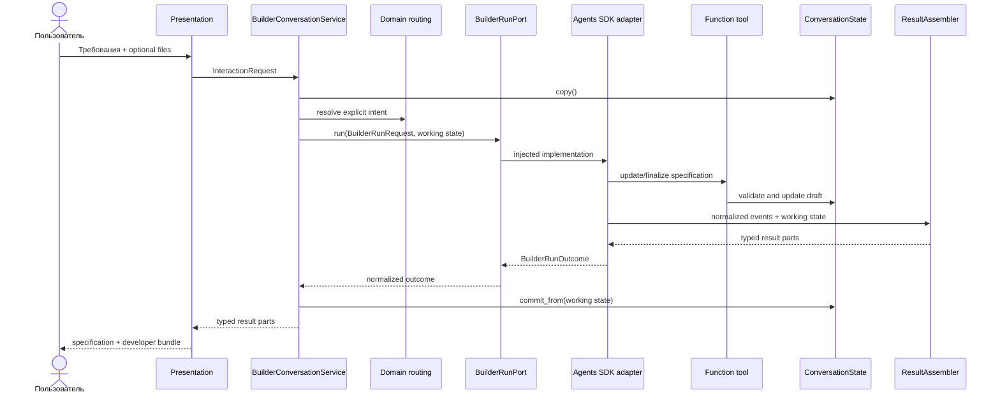
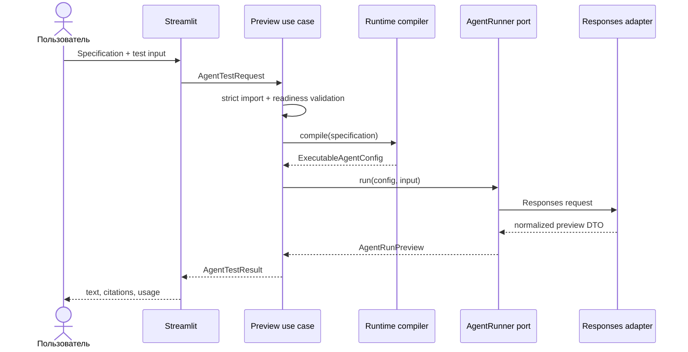
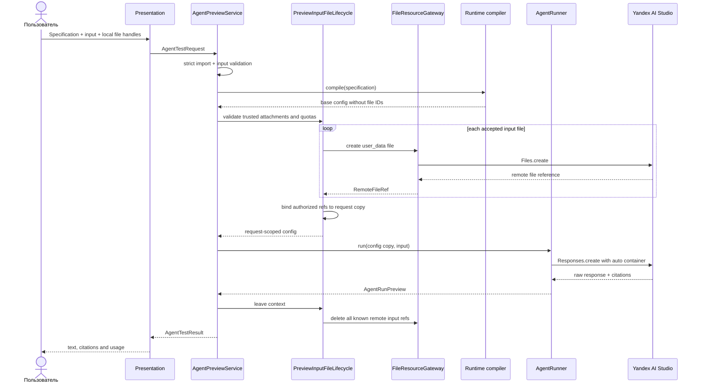

# Ключевые sequence flows

## Построение AgentSpecification

При ошибке adapter, tool или assembly рабочая копия state не коммитится.
Application зависит только от `BuilderRunPort`; concrete Agents SDK adapter и
assembly находятся в слое builder.

## Текущий stateless preview

## Реализованный Code Interpreter input preview (CI-3)

Скачивание generated artifacts добавляется отдельно в CI-4. Оно использует ту
же ownership policy, но не меняет input binding и базовый runtime config.

## Failure semantics Code Interpreter

- Validation failure: provider не вызывается; локальные временные файлы не
  создаются либо удаляются владельцем request.
- Partial upload: все ранее созданные remote input files удаляются.
- Timeout/provider error: remote inputs и известные outputs удаляются;
  пользователю возвращается безопасная taxonomy error.
- Oversized output: чтение останавливается во время stream, partial local file
  удаляется, remote resource переходит в cleanup.
- Cleanup failure: основной успешный результат не теряется; фиксируется bounded
  warning/metric без credentials, file IDs и filenames.
