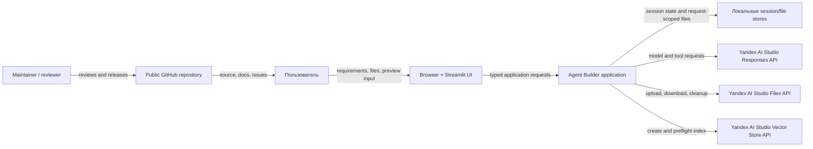

# System context

## Назначение системы

Agent Builder помогает пользователю сформировать переносимую
`AgentSpecification` для one-prompt или RAG-приложения, проверить её через
Yandex AI Studio Responses API и скачать developer bundle. В целевом релизе
preview также поддерживает Code Interpreter с request-scoped входными файлами и
безопасно скачиваемыми результатами.

Система не является хранилищем постоянных AI Studio Agents, системой управления
секретами организации или средой исполнения произвольных пользовательских
контейнеров.

## Акторы и внешние системы

## Trust boundaries

1. **Browser → application.** Текст, имена, MIME и содержимое файлов являются
   недоверенными. UI-валидация улучшает UX, но authoritative validation
   выполняется в application layer.
2. **LLM/function tools → application.** Аргументы модели недоверенные. Модель не
   выбирает credentials, локальные paths, `file_id`, `container_id` или
   разрешённый набор файлов.
3. **Application → Yandex APIs.** Только infrastructure adapters получают
   provider client и преобразуют provider exceptions/objects во внутренние DTO.
4. **Remote files → local artifacts.** Filename, MIME, declared size и
   `Content-Length` недоверенные. Лимиты применяются во время потокового чтения.
5. **Repository → public consumers.** В публикуемую историю не попадают
   credentials, пользовательские файлы, session DB, логи и внутренние brand
   assets без отдельного разрешения.

## Поддерживаемые и экспериментальные поверхности

| Поверхность | Статус `v0.1.0` | Обязательство |
| --- | --- | --- |
| Streamlit Web UI | Поддерживается | Основной пользовательский путь |
| AgentSpecification JSON | Поддерживается | Версионированный переносимый контракт |
| Developer bundle | Поддерживается | Воспроизводимый пример запуска |
| Telegram adapter | Experimental | Может быть исключён из релиза |
| OAuth gateway | Experimental | Не является основным credential flow |

## Основные инварианты

- Credentials никогда не входят в `AgentSpecification`, tool arguments модели
  или пользовательские результаты.
- Временные Files API IDs и container IDs принадлежат одному preview request.
- Builder conversation state коммитится только после успешной сборки результата.
- Preview не изменяет Builder conversation state.
- Yandex Responses/Files/Vector Store types не пересекают infrastructure
  boundary; Agents SDK run events нормализуются внутри builder adapter до
  передачи в result assembly.
- Все удалённые ресурсы имеют определённого владельца cleanup и конечный срок
  жизни.
